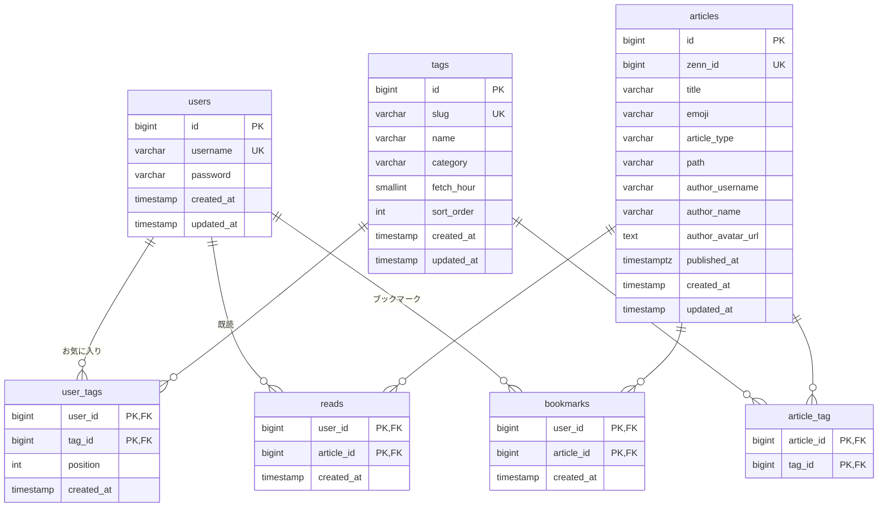

# DB 設計

[← 目次に戻る](README.md)

## ER 図

## テーブル定義

### users（ユーザー）

| カラム | 型 | 制約 | 説明 |
|---|---|---|---|
| id | bigint | PK | |
| username | varchar(20) | UNIQUE, NOT NULL | ログインIDと表示名を兼ねる。半角英数字と `_`、3〜20文字 |
| password | varchar(255) | NOT NULL | ハッシュ化して保存 |
| created_at / updated_at | timestamp | | 登録日として設定画面に表示 |

※ Sanctum のトークンは、Laravel 標準の `personal_access_tokens` テーブルに保存する。

### tags（タグ） ※ Seeder で管理

| カラム | 型 | 制約 | 説明 |
|---|---|---|---|
| id | bigint | PK | |
| slug | varchar(50) | UNIQUE, NOT NULL | Zenn のトピック名（例：`nextjs`）。API の `topicname` に使う |
| name | varchar(50) | NOT NULL | 表示名（例：`Next.js`） |
| category | varchar(50) | NOT NULL | カテゴリ（例：開発言語、インフラ・クラウド） |
| fetch_hour | smallint | NOT NULL, 3〜8 | 取得する時間（日本時間） |
| sort_order | int | NOT NULL | タグ選択画面での並び順 |
| created_at / updated_at | timestamp | | |

### articles（記事） ※ 全ユーザーで共有

| カラム | 型 | 制約 | 説明 |
|---|---|---|---|
| id | bigint | PK | |
| zenn_id | bigint | UNIQUE, NOT NULL | Zenn の記事ID。重複保存の防止に使う |
| title | varchar(255) | NOT NULL | タイトル |
| emoji | varchar(16) | NOT NULL | サムネイル代わりの絵文字 |
| article_type | varchar(10) | NOT NULL | `tech` / `idea` |
| path | varchar(255) | NOT NULL | 記事のパス（`/{username}/articles/{slug}`）。`https://zenn.dev` と連結してURLにする |
| author_username | varchar(255) | NOT NULL | 著者のユーザー名 |
| author_name | varchar(255) | NOT NULL | 著者の表示名 |
| author_avatar_url | text | NULL可 | 著者のアイコンURL（非常に長い場合があるため text） |
| published_at | timestamptz | NOT NULL, INDEX | 公開日時。並び順と保持件数の判定に使う |
| created_at / updated_at | timestamp | | |

### article_tag（記事とタグの紐付け）

| カラム | 型 | 制約 | 説明 |
|---|---|---|---|
| article_id | bigint | PK, FK → articles（CASCADE） | |
| tag_id | bigint | PK, FK → tags（CASCADE）, INDEX | |

- 1つの記事が複数のタグに属せる
- タグごとの「最新100件」は、このテーブルの行で表す

### user_tags（お気に入りタグ）

| カラム | 型 | 制約 | 説明 |
|---|---|---|---|
| user_id | bigint | PK, FK → users（CASCADE） | |
| tag_id | bigint | PK, FK → tags（CASCADE） | |
| position | int | NOT NULL | 並び順（0 始まり）。この昇順でタグバー・サイドバーに並べる |
| created_at | timestamp | NOT NULL | 選んだ日時（記録用。並び順には使わない） |

- 保存時は、画面から送られたタグIDの配列の順番を、そのまま `position` として保存する
- 画面側では、既に選んでいたタグの順番を保ち、新しく選んだタグをタップした順に末尾へ追加する。一度外して選び直したタグも末尾に移る
- `created_at` で並べると、一度に複数のタグを保存したときに日時が同じになって順番が決まらないため、`position` カラムを使う

### reads（既読）

| カラム | 型 | 制約 | 説明 |
|---|---|---|---|
| user_id | bigint | PK, FK → users（CASCADE） | |
| article_id | bigint | PK, FK → articles（CASCADE） | |
| created_at | timestamp | NOT NULL | 読んだ日時 |

- 行があれば既読、なければ未読

### bookmarks（ブックマーク）

| カラム | 型 | 制約 | 説明 |
|---|---|---|---|
| user_id | bigint | PK, FK → users（CASCADE） | |
| article_id | bigint | PK, FK → articles（CASCADE） | |
| created_at | timestamp | NOT NULL, INDEX（user_id と複合） | ブックマークした日時。BOOKMARK タブの並び順に使う |

- 1ユーザー100件の上限は、アプリケーション側でチェックする

## 各タブの取得条件

ログインユーザーを `U`、表示中のタグを `T` とする。

| タブ | 条件 |
|---|---|
| NEW | `article_tag.tag_id = T` の記事のうち、`reads` に `(U, 記事)` がないもの |
| READ | `article_tag.tag_id = T` の記事のうち、`reads` に `(U, 記事)` があるもの |
| BOOKMARK | `bookmarks.user_id = U` の記事すべて（`T` に関係なく全件） |

## 記事の削除ルール

各タグの取得処理の後に、以下を実行する。

1. そのタグの `article_tag` を、記事の `published_at` が新しい順に並べ、101件目以降の行を削除する
2. `article_tag` の行が1つもなく、かつ誰もブックマークしていない記事を `articles` から削除する
   - 削除された記事の `reads` は CASCADE で消える
3. ブックマークされている記事は、`article_tag` の行がなくなっても残る（BOOKMARK タブでのみ見られる）
4. ブックマークを外した記事は、次回以降の削除処理（手順2）で削除対象になる

## 退会時の削除

`users` の行を削除すると、`user_tags` / `reads` / `bookmarks` / `personal_access_tokens` も削除する。記事（`articles`）は全ユーザーで共有しているため削除しない。
